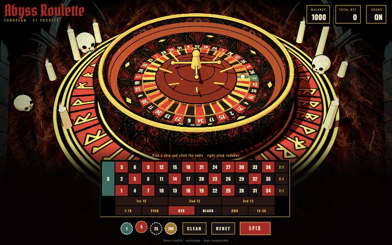

# Abyss Roulette

A 3D European roulette game in the browser, drawn like a Mike Mignola comic: hard toon shading, ink outlines, deep black shadows, crimson, ochre and teal colors, candles, skulls and drifting embers.



> **Prototype with demo credits.** It uses no real money. See [Production notes](#production-notes) before you build anything real on top of it.

## Features

- **European single-zero wheel** with the real 37-pocket order, colors and payouts
- **Physically plausible ball path**: the ball is thrown against the rotor, rides the track, clips a deflector, bounces across the frets and settles. It always lands on the pre-drawn result, so a server can decide the outcome.
- **Unbiased RNG**: `crypto.getRandomValues` with rejection sampling, so there is no modulo bias
- **Toon look built in code**: a 3-step gradient map, inverted-hull ink outlines and hand-hatched canvas textures for the wheel and sigil
- **Generated art (optional)**: a backdrop, sigil, felt and wood textures made with Gemini 2.5 Flash Image through OpenRouter. Every image has a procedural fallback.
- **Layered audio mix**: streamed jazz lounge music and short Pixabay effects share a compressor. Music ducks during spins and wins; ball-roll playback follows the ball's speed. Short effects have synthesized fallbacks.
- **Comic result FX**: a "KRA-THOOM!" banner, screen shake, a red flash and an ember burst on wins. Winning bets light up and the balance counts up.
- **Phone layout**: in portrait the betting table turns vertical, and it slides away while the ball is live so the wheel fills the screen
- **Saved progress**: the balance, the last bets and the history survive a reload. **REFILL** appears when you run out of credits.
- **Accessible**: the table works from the keyboard, screen readers hear the results, and `prefers-reduced-motion` turns off the shake and flashes

## Controls

| Action | Input |
|---|---|
| Pick a chip value | Click a chip (1 · 5 · 25 · 100) or press <kbd>1</kbd>–<kbd>4</kbd> |
| Place a bet | Click or tap a cell, or focus it with <kbd>Tab</kbd> and press <kbd>Enter</kbd> |
| Take back the last chip | **UNDO**, <kbd>Z</kbd> or <kbd>Backspace</kbd> |
| Remove every chip from one cell | Right-click it, or press <kbd>Delete</kbd> while it has focus |
| Spin | **SPIN** or <kbd>Space</kbd> |
| Repeat the last round's bets | **REBET** or <kbd>R</kbd> |
| Clear all bets | **CLEAR** or <kbd>C</kbd> |
| Get more demo credits | **REFILL** (only shown when you're out) |
| Mute or unmute | **SOUND** or <kbd>M</kbd> (the choice is remembered) |

### Bets and payouts

| Bet | Pays |
|---|---|
| Straight number (0–36) | 35:1 |
| Dozen (1st / 2nd / 3rd 12) | 2:1 |
| Column (2:1) | 2:1 |
| Red / Black · Even / Odd · 1–18 / 19–36 | 1:1 |

Zero loses every outside bet.

## Quick start

You need **Node 22.9+**.

```bash
npm install
npm run dev
```

Then open the URL that Vite prints. Click once or press a key to start the audio, because browsers block sound until a user gesture.

### Scripts

| Command | What it does |
|---|---|
| `npm run dev` | Starts the dev server with hot reload |
| `npm run build` | Builds the production bundle into `dist/` |
| `npm run preview` | Serves the production build locally |
| `npm run gen:assets` | Generates the missing art with OpenRouter |
| `npm run audio:prepare` | Turns the raw audio downloads into game-ready files (needs `ffmpeg`) |

## Generated art

`scripts/gen-assets.mjs` sends a prompt to `google/gemini-2.5-flash-image` through OpenRouter and saves each image as a PNG in `public/assets/`. When `cwebp` is installed, it also writes a WebP copy that is about 10× smaller. The game loads the WebP first and falls back to the PNG. Only the WebP files are committed (~500 KB in total).

| Asset | Used for |
|---|---|
| `background` | Full-screen backdrop behind the 3D scene |
| `emblem` | Rune sigil under the wheel |
| `felt` | Table cloth texture |
| `wood` | Wheel bowl texture |

```bash
cp .env.example .env              # add your OPENROUTER_API_KEY
npm run gen:assets                # generate only the missing assets
npm run gen:assets -- --force     # regenerate all of them
npm run gen:assets -- emblem      # generate a single asset
```

Every asset is optional. If a file is missing, the game draws a procedural version instead.

## Audio

The current soundtrack is **Luxury Jazz Lounge Background Music** by Top-Flow,
with six selected Pixabay effects for chips, roulette, UI and brass celebrations.
[AUDIO_CREDITS.md](AUDIO_CREDITS.md) lists the source pages, authors and processing.

Put the seven original MP3s in `audio-src/` (gitignored), keeping the Pixabay ID
in each filename, then run:

```bash
npm run audio:prepare
node --test scripts/test-audio.mjs
```

The pipeline normalizes levels, prepares rolling loops and removes obsolete
exports. It keeps the current runtime set if any selected source is missing.

The first tap or key press unlocks playback. Music streams through an HTML audio
element routed into the Web Audio mixer, while only short effects are decoded in
memory. Music lowers during spins and wins. Sound settings persist, and changing
tabs pauses audio. Missing effects retain synthesized fallbacks. Physical iPhone
playback still needs device validation.

## How the spin works

The client receives a pocket index and animates the ball to it. The physics never decides the result.

- The ball's angle `psi` is measured **relative to the rotor**, and pocket `i` sits at `psi = i · SEG`.
- During the spin, `psi` eases from `target + A` to `target`, where `A` adds several full turns. The ball therefore always comes to rest in the drawn pocket.
- The spin runs on wall-clock time, so a slow frame doesn't change the outcome or the length of the round.

In production, the server sends the index and `startSpin()` only animates it.

## Project structure

```
src/
  main.js     ball path, betting and payouts, UI, camera, game loop
  scene.js    renderer, lights, toon materials, wheel, props, particles
  rules.js    wheel order, bet table, secure RNG
  audio.js    streaming lounge music, SFX, rolling loops, fallbacks, mute
  style.css   comic-panel UI
scripts/
  gen-assets.mjs     AI art generation (OpenRouter)
  prepare-audio.mjs  ffmpeg audio pipeline
public/
  assets/     generated images (optional)
  audio/      prepared audio and manifest.json
```

**Stack:** [Three.js](https://threejs.org/) · [Vite](https://vite.dev/) · Web Audio API. There is no framework.

## Roadmap

- [x] Ball spins against the rotor, as on a real wheel
- [x] Refill when the balance hits zero, and keep the balance between sessions
- [x] Undo the last chip, which also works on touch screens
- [x] Phone layout with a vertical table that slides away during the spin
- [x] Keyboard betting, `aria-live` result announcements, `prefers-reduced-motion`
- [x] WebP images: ~500 KB instead of 5.3 MB of PNGs
- [ ] Inside bets: split, street, corner, six line, 0-1-2-3
- [ ] Table limits
- [x] Jazz lounge soundtrack, physical roulette effects and brass victory cue

## Production notes

This demo is not built for real-money play.

- **The outcome must come from the server**, drawn by a certified RNG. The client draws it here only for the demo.
- **The server must own balances and payouts.** Today the client tracks both.
- Before a commercial release, check the original license of every `freesound_community` sound. [AUDIO_CREDITS.md](AUDIO_CREDITS.md) has the details.
- Gambling is regulated by market. Make sure the product runs legally wherever it is offered.

## License

Code: [MIT](LICENSE) © 2026 Alexandre Junior. Audio and generated art follow the terms in [AUDIO_CREDITS.md](AUDIO_CREDITS.md) and the [Generated art](#generated-art) section.
